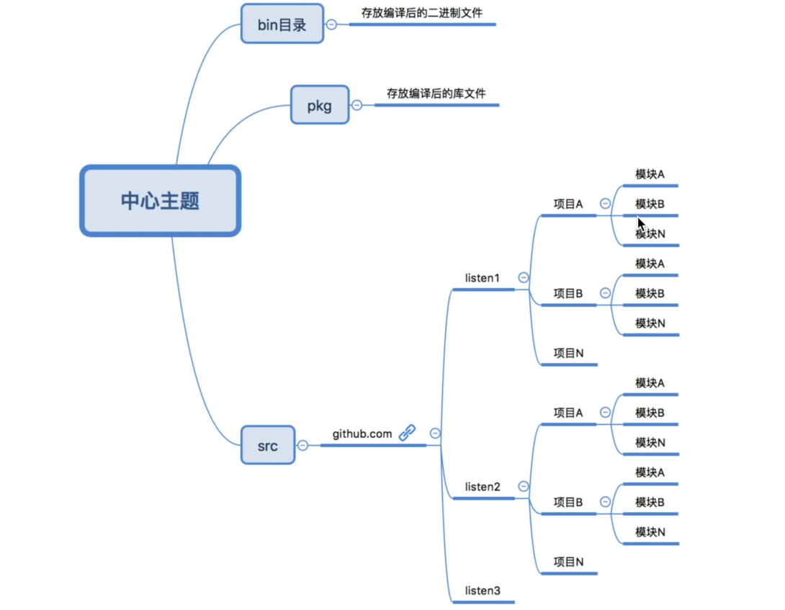

# Golang

## 环境搭建

### Go的目录结构方式




### Go 常用命令介绍

```shell
go run filename
go build package name
go build -o bin/hello.exe package name
go install 
go test
go env 
go fmt 格式化源码
```

### Golang语言特性

- 垃圾回收

- 天然并发

  gorountine

  ```go
  func calc() {
  	// 大量计算
  }
  func main() {
  	go calc() // 协程
  }
  ```

- channel

  先进先出，支持任何类型。

- 多返回值

- 编译型语言

## 数据类型

**var定义变量**

**常量**：必须要赋值

```go
package main

import "fmt"

const PI = 3.14

func main()
{
	const GFG = "GeeksforGeeks"
	fmt.Println("Hello", GFG)

	fmt.Println("Happy", PI, "Day")

	const Correct= true
	fmt.Println("Go rules?", Correct)
}
```

[4 iota enum examples](https://yourbasic.org/golang/iota/)

每增加一行加1

```go
type Direction int

const (
    North Direction = iota
    East
    South
    West
)

func (d Direction) String() string {
    return [...]string{"North", "East", "South", "West"}[d]
}		
```

**[fmt.Printf formatting tutorial and cheat sheet](https://yourbasic.org/golang/fmt-printf-reference-cheat-sheet/#float)**

反引号原生输出。

## 字符串原理和时间日期

### 字符串原理

rune表示utf8字符，一个中文占3个字节。修改string需要先转换才能修改。

中文逆序，需要施工rune来使用。`var r []rune = []rune(str)` 切片转换。


